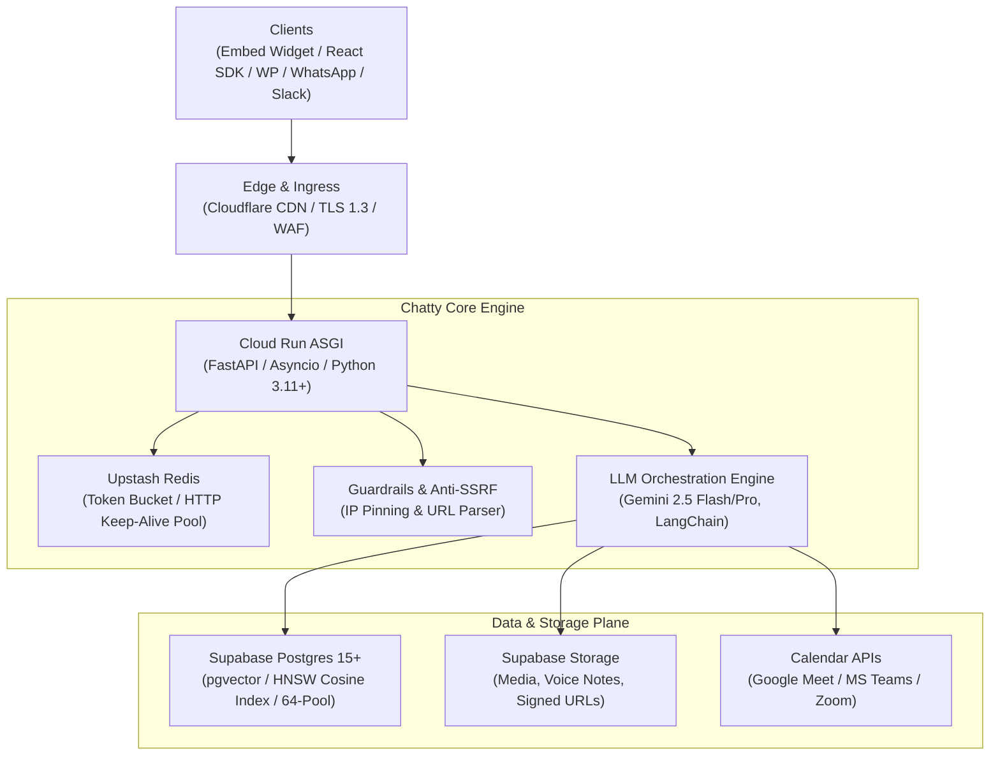
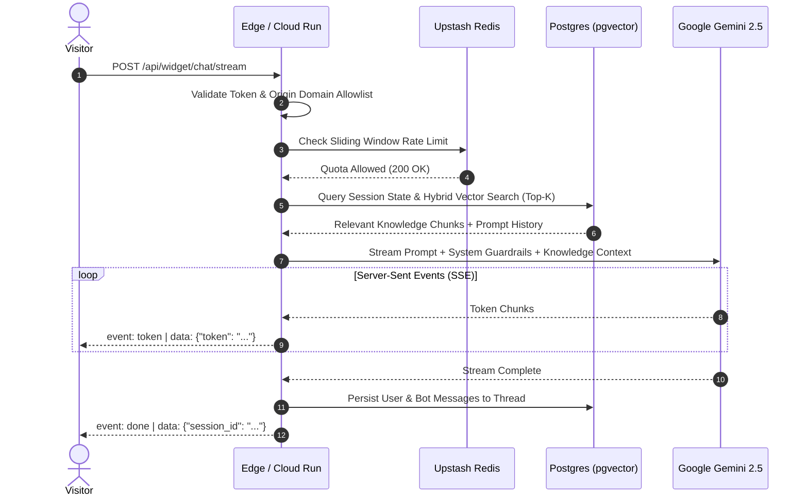

export const metadata = { title: "Architecture", description: "Deep dive into Chatty's backend infrastructure, data flow, concurrency model, and security boundaries." }

import { Note, Tip, Warning, Info } from "@/components/mdx/Callout"
import { Card, CardGroup } from "@/components/mdx/Card"
import { Accordion, AccordionGroup } from "@/components/mdx/Accordion"
import { PageNav } from "@/components/PageNav"
import { prevNext } from "@/lib/navigation"

# Platform Architecture

Chatty is built as a high-throughput, enterprise-grade AI chatbot platform designed to serve thousands of concurrent visitors with sub-second streaming latency, zero data cross-contamination, and strict tenant isolation.

This document breaks down the underlying infrastructure, real-time request lifecycle, database pooling, and defense-in-depth security model.

---

## High-Level Topology

Chatty follows a distributed, event-driven architecture decoupled across edge delivery, asynchronous API compute, managed vector search, and external LLM provider clusters:



---

## Core Infrastructure Layers

<CardGroup cols={2}>
  <Card title="Asynchronous ASGI Engine" icon="⚡">
    Built on <b>FastAPI</b> and <b>Uvicorn</b> running on Google Cloud Run. Every network I/O call (database queries, vector similarity, Redis counters, LLM tokens) is 100% non-blocking.
  </Card>
  <Card title="Vector RAG Pipeline" icon="🧠">
    Powered by <b>Supabase PostgreSQL</b> with <b>pgvector</b>. Uses 768-dimensional embeddings generated by Google's `text-embedding-004` model with indexed HNSW cosine distance search.
  </Card>
  <Card title="Persistent Edge Rate Limiting" icon="🛡️">
    Distributed rate limiting and ephemeral state backed by <b>Upstash Redis</b> with persistent HTTP connection pooling, preventing TLS renegotiation overhead.
  </Card>
  <Card title="Multi-Channel Adapters" icon="🔌">
    Native support for the Embed Widget, React SDK, WordPress plugin, WhatsApp Business API, Slack slash commands, and Model Context Protocol (MCP).
  </Card>
</CardGroup>

---

## The Request Lifecycle

When a visitor interacts with a Chatty widget or API client, the request traverses multiple verification and processing stages:



### 1. Ingress & Origin Allowlist
Public widget endpoints check the incoming HTTP `Origin` header against the bot's configured **domain allowlist**. If a domain is not authorized, the backend immediately terminates the connection with `403 Forbidden` and injects `Content-Security-Policy: frame-ancestors 'none'` to block unauthorized iframe embedding.

### 2. Upstash Distributed Rate Limiting
To protect backend workers from volumetric abuse, requests pass through an Upstash Redis token bucket algorithm. Counters are partitioned by client IP (for widget traffic) or SHA-256 API key hash (for developer API calls). Upstash HTTP connections are pooled with keep-alive, avoiding TCP handshake penalties.

### 3. Session Resolution & Human Takeover Check
The conversation session UUID is retrieved from PostgreSQL. If the session has `ai_paused: true` (e.g. a customer support agent initiated a human takeover), the AI pipeline is bypassed, and the visitor message is routed directly to the Live Inbox dashboard.

### 4. Hybrid Knowledge Retrieval (RAG)
If knowledge sources exist, Chatty performs hybrid retrieval:
1. **Semantic Vector Search**: Computes cosine distance against `knowledge_chunks` using `pgvector` embeddings (`<=>` operator).
2. **Keyword Filtering**: Matches high-confidence lexical tokens.
3. Top results are deduplicated, reranked, and formatted with document metadata (source URL, file title, page number) into the LLM system prompt.

### 5. Non-Blocking SSE Streaming
The orchestrator dispatches the assembled context to Google Gemini with streaming enabled. Token generators yield `text/event-stream` chunks directly through FastAPI's `StreamingResponse`, achieving Time-To-First-Token (TTFT) under 400ms.

---

## Concurrency & Database Pooling

Database connection exhaustion is the most common failure point in AI applications that handle long-running LLM streams. Chatty mitigates this with a robust pooling architecture:

```
[Cloud Run Instances] (Concurrency: 50 per instance)
         │
         ├── Worker 1 ──┐
         ├── Worker 2 ──┼──> [Async SQLAlchemy Engine]
         └── Worker N ──┘            │
                                     ▼
                     [64-Worker Connection Pool]
                        - pool_size: 20
                        - max_overflow: 44
                        - pool_timeout: 30s
                        - pool_recycle: 1800s
                        - pool_pre_ping: true
                                     │
                                     ▼
                     [Supabase Transaction Pooler]
                              (Port 6543)
```

<AccordionGroup>
  <Accordion title="Pre-Ping & Automatic Recycling">
    Database connections are configured with `pool_pre_ping=True` and a 30-minute recycle window (`pool_recycle=1800`). Any dead or dropped connections caused by network partitions or Cloud Run scale-down events are evicted before a query attempts execution.
  </Accordion>
  <Accordion title="Immediate Connection Release During Streaming">
    FastAPI sessions only hold a database connection while loading session history and vector chunks. The database transaction is closed **before** the long-running LLM streaming loop starts. Once the stream ends, a new pooled connection is acquired for a few milliseconds to save the completed response.
  </Accordion>
  <Accordion title="Keep-Alive Redis HTTP Pooling">
    Upstash Redis operations utilize a singleton HTTP transport with persistent TCP keep-alive sockets. This eliminates SSL handshake latency on every rate limit check.
  </Accordion>
</AccordionGroup>

---

## Security Boundaries & Isolation

Chatty enforces enterprise security boundaries at every level of the stack:

| Boundary | Mechanism | Purpose |
| :--- | :--- | :--- |
| **Tenant Isolation** | PostgreSQL Row-Level Security (RLS) | Restricts database records strictly to the authenticated `user_id` or bot owner. |
| **SSRF Prevention** | Pre-flight DNS resolution & IP pinning | Prevents Server-Side Request Forgery against cloud metadata (`169.254.169.254`) and private RFC-1918 subnets. |
| **Upload Safety** | Stream-capped chunked readers (20MB) | Enforces maximum upload byte caps before writing to disk, preventing memory exhaustion and DoS. |
| **JWT Verification** | Asymmetric JWKS public key validation | Verifies Supabase authentication tokens cryptographically with cached public key rotation. |
| **BYOK Encryption** | AES-256-GCM symmetric encryption | Encrypts customer-supplied API keys (OpenAI, Anthropic, Gemini) before database persistence. |

<Note>
For detailed security specifications, vulnerability reporting, and GDPR compliance, visit our [Security & Privacy](/security) reference.
</Note>

<PageNav {...prevNext("/architecture")} />
