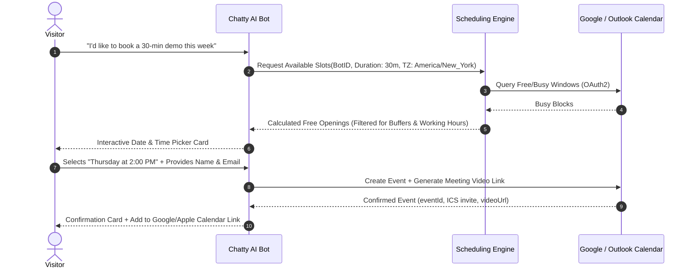

export const metadata = { title: "Calendar & Scheduling", description: "Connect Google Calendar, Microsoft Outlook, and Zoom to automate meeting booking directly inside conversations." }

import { Note, Tip, Warning, Info } from "@/components/mdx/Callout"
import { Card, CardGroup } from "@/components/mdx/Card"
import { Accordion, AccordionGroup } from "@/components/mdx/Accordion"
import { PageNav } from "@/components/PageNav"
import { prevNext } from "@/lib/navigation"

# Calendar & Meeting Scheduling

Chatty turns conversations into booked demos and consultations without sending visitors to third-party scheduling links. The AI bot checks real-time calendar availability, calculates timezone offsets, proposes free slots, and generates Google Meet, Microsoft Teams, or Zoom links natively inside the chat thread.

---

## Supported Providers

<CardGroup cols={3}>
  <Card title="Google Calendar" icon="📅">
    Full two-way synchronization with Google Workspace. Generates unique <b>Google Meet</b> video links automatically.
  </Card>
  <Card title="Microsoft 365" icon="📆">
    Connects with Outlook Calendar and generates enterprise <b>Microsoft Teams</b> meeting rooms.
  </Card>
  <Card title="Zoom Video" icon="📹">
    Integrate Zoom to append password-protected meeting rooms to booked calendar events.
  </Card>
</CardGroup>

---

## How In-Chat Booking Works



---

## Availability Engine Rules

The Chatty scheduling engine calculates open slots dynamically based on your team's configuration:

<AccordionGroup>
  <Accordion title="Working Hours & Days">
    Define working schedules per team member (e.g. Monday–Friday, 09:00 to 17:00). Slots outside these windows are automatically pruned.
  </Accordion>
  <Accordion title="Buffer Times Between Calls">
    Prevent back-to-back fatigue by setting mandatory buffer intervals (e.g. 10 or 15 minutes) before and after each event.
  </Accordion>
  <Accordion title="Notice Period & Advance Booking Window">
    - **Minimum Notice**: Prevent visitors from booking slots in the immediate next hour (e.g. minimum 2 hours notice).
    - **Max Horizon**: Restrict bookings to a foreseeable horizon (e.g. up to 14 or 30 days in advance).
  </Accordion>
  <Accordion title="Automatic Timezone Conversion">
    The widget automatically detects the visitor's local IANA timezone (`visitor_timezone`) and translates host availability in real-time, eliminating manual timezone math.
  </Accordion>
</AccordionGroup>

---

## Round-Robin Team Routing

For sales and support teams with multiple representatives:

1. **Round-Robin Assignment**: Distribute incoming meetings equally among team members.
2. **Priority Routing**: Assign leads to specific account executives based on custom qualifying criteria (e.g. company size, geography, or inquiry topic).
3. **Collective Availability**: Only display slots where all required team participants are simultaneously free.

---

## In-Chat Booking Component

When the AI detects scheduling intent, it renders an interactive booking widget directly into the conversation stream:

```
+-------------------------------------------------------------+
| 📅 Schedule a 30-Min Consultation                          |
+-------------------------------------------------------------+
| Select Date:                                                |
| [ Mon, Oct 14 ]  [ Tue, Oct 15 ]  [ Wed, Oct 16 ]           |
|                                                             |
| Available Times (EDT):                                      |
| [ 10:00 AM ]  [ 11:30 AM ]  [ 02:00 PM ]  [ 04:00 PM ]      |
|                                                             |
| Name:  [ Sarah Jenkins           ]                          |
| Email: [ sarah@acme-corp.com     ]                          |
|                                                             |
| [ Confirm Booking ]                                         |
+-------------------------------------------------------------+
```

---

## Automated Confirmations & Rescheduling

Once booked:
- **Instant Calendar Invites**: An `.ics` calendar invitation is automatically dispatched to the visitor's email address with video call links.
- **Meeting Reminders**: Send automated WhatsApp or email reminders 24 hours and 1 hour before the scheduled start.
- **Self-Serve Rescheduling**: Confirmation emails contain a secure rescheduling token allowing attendees to pick a new slot or cancel with one click, without needing to contact support.

---

## Anti-Spam & Abuse Protection

Automated calendar booking widgets can be vulnerable to automated spam bots, fake email submissions, and malicious calendar flooding. Chatty provides **4 concrete anti-abuse defenses** located in the Chatty Dashboard under **Bot Settings &rarr; Calendar Scheduling &rarr; Abuse & Spam Protection** (all optional and disabled by default):

<CardGroup cols={2}>
  <Card title="Email OTP Verification" icon="🔒">
    <b>Strongest Defense:</b> Dispatches a secure 6-digit one-time passcode to the visitor's email inbox. The AI assistant requires the visitor to enter the correct code in the chat before finalizing the calendar reservation.
  </Card>
  <Card title="Block Disposable Emails" icon="🛡️">
    Instantly detects and rejects burner/throwaway email providers (e.g. `@mailinator.com`, `@tempmail.com`, `@guerrillamail.com`, `@10minutemail.com`) to guarantee authentic contact channels.
  </Card>
  <Card title="Limit 1 Active Booking" icon="⏱️">
    Restricts each attendee email address to at most 1 active/upcoming meeting concurrently. Prevents single visitors from monopolizing your team's calendar availability.
  </Card>
  <Card title="Require Business Email" icon="🏢">
    Filters out free consumer inboxes (`@gmail.com`, `@yahoo.com`, `@hotmail.com`, `@outlook.com`, `@icloud.com`) and mandates corporate/work domains (ideal for B2B qualification).
  </Card>
</CardGroup>

### Recommended Defense Profiles

- **B2B Sales & Enterprise Demos**: Turn on **Require Business Email** and **Email OTP Verification**. Guarantees that every booked demo is tied to a real, verified corporate buyer.
- **B2C Consultations & General Support**: Turn on **Block Disposable Emails** and **Limit 1 Active Booking Per Email**. Welcomes standard consumer email accounts while stopping throwaway abuse and duplicate slot hoarding.
- **Maximum Anti-Bot Defense**: Turn on **Email OTP Verification**. Because automated scripts cannot read the recipient's private email inbox, bot-generated fake meetings are stopped completely.

<Tip>
Configure your calendar integration and spam protection in the Chatty Dashboard under **Bot Settings &rarr; Integrations &rarr; Calendar Scheduling**.
</Tip>

<PageNav {...prevNext("/guides/calendar-scheduling")} />
