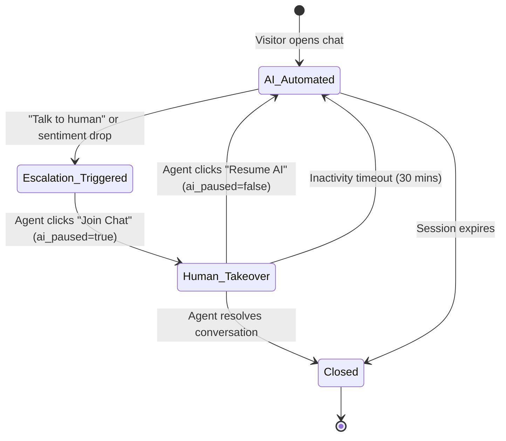

export const metadata = { title: "Live Inbox & Takeover", description: "Transition conversations seamlessly from AI automation to human support agents in real-time." }

import { Note, Tip, Warning, Info } from "@/components/mdx/Callout"
import { Card, CardGroup } from "@/components/mdx/Card"
import { Accordion, AccordionGroup } from "@/components/mdx/Accordion"
import { PageNav } from "@/components/PageNav"
import { prevNext } from "@/lib/navigation"

# Live Inbox & Human Takeover

While Chatty resolves 80%+ of routine customer inquiries autonomously, high-stakes sales opportunities and complex edge cases require human empathy. The **Live Inbox** enables human agents to monitor active conversations in real-time and take over instantaneously.

---

## The Escalation Lifecycle



---

## Escalation Triggers

Conversations can transition from AI to human operators through four primary pathways:

<CardGroup cols={2}>
  <Card title="Visitor Intent Recognition" icon="🙋‍♂️">
    When a visitor types phrases like <i>"can I talk to a real person?"</i>, <i>"representative"</i>, or clicks a quick-reply escalation button.
  </Card>
  <Card title="Sentiment & Frustration Detection" icon="📉">
    Gemini continuously analyzes visitor sentiment score. If repeated frustration or dissatisfaction is flagged, an escalation alert triggers automatically.
  </Card>
  <Card title="Rule-Based Keyword Matching" icon="🎯">
    Define critical business triggers (e.g. <code>refund</code>, <code>enterprise pricing</code>, <code>legal</code>, <code>cancel subscription</code>) that immediately ping agents.
  </Card>
  <Card title="Operator Manual Intercept" icon="👀">
    Agents monitoring the Live Inbox can click <b>Take Over</b> at any time to pause the AI mid-thread and begin typing.
  </Card>
</CardGroup>

---

## The `ai_paused` State Machine

When a takeover occurs:
1. The conversation record sets `ai_paused = true` in PostgreSQL.
2. The backend streaming router (`/api/widget/chat/stream`) detects the flag and stops generating LLM completions.
3. If the visitor continues typing, incoming messages are flagged as `sender: "visitor"` and delivered directly to the operator's Live Inbox via real-time WebSocket subscriptions.
4. The widget displays an indicator: *"Sarah has joined the conversation"*.

```json title="Session State Object"
{
  "session_id": "1fa85f64-5717-4562-b3fc-2c963f66afa6",
  "ai_paused": true,
  "assigned_agent_id": "agent_usr_9912",
  "assigned_agent_name": "Sarah Connor",
  "escalated_at": "2026-09-07T14:32:00Z"
}
```

---

## Operator Inbox Capabilities

The Chatty Dashboard Live Inbox is built for speed and high-concurrency support teams:

<AccordionGroup>
  <Accordion title="Real-Time Typing Indicators & Sound Alerts">
    Operators see live visitor keystrokes as they type, enabling lightning-fast replies. Audible and browser desktop notifications ensure no urgent inquiry is missed.
  </Accordion>
  <Accordion title="AI Co-Pilot Draft Suggestions">
    Even while an agent is in control, Chatty analyzes the visitor's query and suggests one-click suggested responses based on knowledge base documentation.
  </Accordion>
  <Accordion title="Canned Responses & Macros">
    Insert pre-approved team macros by typing shortcuts like `/pricing`, `/refund`, or `/zoom` into the agent composer.
  </Accordion>
  <Accordion title="Rich Media Attachments">
    Agents can upload screenshots, PDF invoices, and documentation directly into the chat thread.
  </Accordion>
</AccordionGroup>

---

## Resuming AI Automation

When the human agent finishes resolving the complex inquiry:
- **Manual Handoff**: Click **Resume Bot**. The `ai_paused` flag resets to `false`, and Chatty resumes fielding subsequent questions.
- **Automatic Inactivity Safeguard**: If an agent forgets to close the ticket or resume the bot, Chatty automatically resumes AI answering after 30 minutes of agent inactivity.

---

## Post-Chat CSAT Surveys

When a conversation is marked resolved (either by the bot or human operator), Chatty can automatically present a 5-star or emoji Customer Satisfaction (CSAT) rating card:

```
+-------------------------------------------------------------+
| How would you rate your support experience today?           |
|                                                             |
|   ⭐ ⭐ ⭐ ⭐ ⭐                                            |
|                                                             |
| [ Add optional feedback comment...                        ] |
| [ Submit Feedback ]                                         |
+-------------------------------------------------------------+
```

CSAT metrics are aggregated in the [Analytics Summary](/api-reference/analytics/summary) dashboard.

<PageNav {...prevNext("/guides/human-takeover")} />
