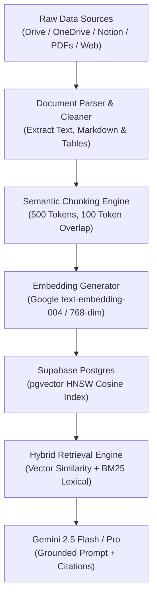

export const metadata = { title: "Cloud Drive & RAG", description: "Index Google Drive, Microsoft OneDrive, Notion, and web sitemaps into vector search for grounded AI answers." }

import { Note, Tip, Warning, Info } from "@/components/mdx/Callout"
import { Card, CardGroup } from "@/components/mdx/Card"
import { Accordion, AccordionGroup } from "@/components/mdx/Accordion"
import { PageNav } from "@/components/PageNav"
import { prevNext } from "@/lib/navigation"

# Cloud Drive Sync & RAG Pipeline

Retrieval-Augmented Generation (RAG) ensures your chatbot delivers accurate, hallucination-free answers grounded in your company's actual internal documentation. Chatty automatically indexes and synchronizes files from **Google Drive**, **Microsoft OneDrive**, **Notion**, and **live web sitemaps** directly into high-dimensional vector embeddings.

---

## Supported Knowledge Connectors

<CardGroup cols={2}>
  <Card title="Google Drive" icon="📁">
    Connect Google Workspace or personal Drive folders. Continuously synchronizes Google Docs, Sheets, Slides, and uploaded PDFs.
  </Card>
  <Card title="Microsoft OneDrive / SharePoint" icon="☁️">
    Index enterprise SharePoint libraries and OneDrive folders with real-time Microsoft Graph delta updates.
  </Card>
  <Card title="Notion Knowledge Bases" icon="📝">
    Sync Notion team workspaces, documentation wikis, and databases. Honors page nesting hierarchies.
  </Card>
  <Card title="Web Sitemap Crawler" icon="🌐">
    Supply an XML sitemap or root URL. Chatty crawls child links, strips HTML boilerplate using Jina Reader, and indexes clean content.
  </Card>
</CardGroup>

---

## The RAG Ingestion Pipeline



---

## Chunking & Embedding Specifications

To preserve semantic context without exceeding LLM attention spans, documents are processed according to strict indexing parameters:

<AccordionGroup>
  <Accordion title="Recursive Character Splitting">
    Content is segmented using recursive boundary splitting: paragraphs (`\n\n`), sentences (`. `), and words (` `). Target chunk size is **500 tokens** (~375 words) with a **100-token sliding overlap** to prevent context clipping at boundaries.
  </Accordion>
  <Accordion title="High-Density Embeddings (text-embedding-004)">
    Every text chunk is passed to Google's state-of-the-art `text-embedding-004` model, generating a **768-dimensional normalized vector**.
  </Accordion>
  <Accordion title="PostgreSQL HNSW Indexing">
    Embeddings are indexed in PostgreSQL using Hierarchical Navigable Small World (`HNSW`) graphs with cosine distance (`vector_cosine_ops`), delivering sub-15ms nearest-neighbor lookups across hundreds of thousands of vectors.
  </Accordion>
</AccordionGroup>

---

## Continuous Synchronization

Documents evolve constantly. Chatty prevents stale information through automated sync mechanisms:

- **Delta Sync Webhooks**: For Google Drive and OneDrive, webhooks alert Chatty whenever a file is updated or deleted. Only modified documents are re-chunked.
- **SHA-256 Content Hashing**: Before computing new embeddings, Chatty checks document content hashes. If a file was saved without text changes, vector recalculation is skipped to save compute quotas.
- **Scheduled Sitemap Polling**: Web sources are recrawled on a configurable cadence (Daily, Weekly, or Monthly) to pick up newly published blog posts or documentation updates.

---

## Citations & Source Attribution

When Chatty answers using RAG knowledge, it extracts metadata (document title, source URL, page number) and appends formatted citation chips:

```
Based on our enterprise service agreement, customers are entitled to 99.9% uptime
with 24/7 priority phone support [1]. Migration assistance is included at no extra charge [2].

Sources:
[1] Enterprise SLA Guidelines.pdf (Page 4)
[2] https://docs.example.com/onboarding/migration
```

<Tip>
You can manage, re-index, or delete individual knowledge sources programmatically using the [Add Knowledge API](/api-reference/knowledge/add) and [Delete Knowledge API](/api-reference/knowledge/delete).
</Tip>

<PageNav {...prevNext("/guides/knowledge-base-rag")} />
