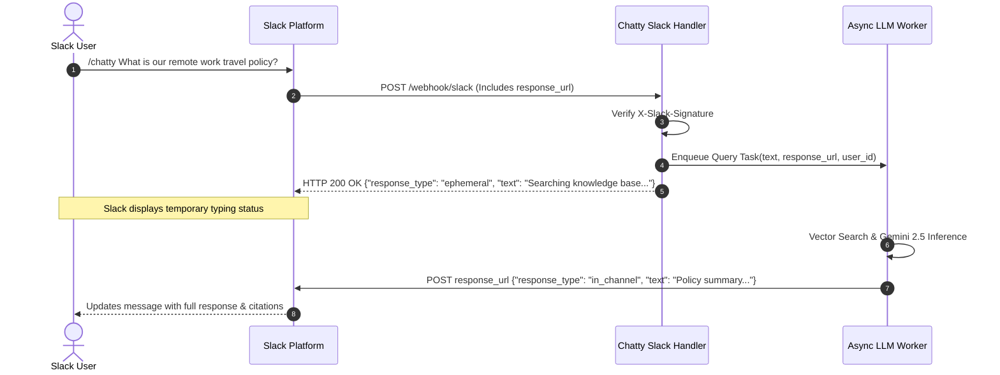

export const metadata = { title: "Slack Integration", description: "Deploy Chatty bots inside Slack workspaces with slash commands and event mentions." }

import { Note, Tip, Warning, Info } from "@/components/mdx/Callout"
import { Card, CardGroup } from "@/components/mdx/Card"
import { Accordion, AccordionGroup } from "@/components/mdx/Accordion"
import { PageNav } from "@/components/PageNav"
import { prevNext } from "@/lib/navigation"

# Slack Integration & Slash Commands

Bring Chatty directly into your team's Slack workspace. Team members can query internal knowledge bases, draft technical documentation, or search company policies using the `/chatty` slash command or by mentioning `@Chatty` in project channels.

---

## Architecture & Async Response Pipeline

Slack requires slash commands to return an HTTP `200 OK` within **3,000 milliseconds**. Because comprehensive AI reasoning and vector search often take 2–5 seconds, Chatty uses an asynchronous acknowledgment and `response_url` webhook pattern:



---

## Setup Instructions

### 1. Create Slack App from Manifest

1. Go to [api.slack.com/apps](https://api.slack.com/apps) and click **Create New App** &rarr; **From an app manifest**.
2. Select your workspace and paste the following JSON manifest:

```json title="slack-manifest.json"
{
  "display_information": {
    "name": "Chatty AI",
    "description": "Company AI Knowledge Assistant",
    "background_color": "#4F46E5"
  },
  "features": {
    "bot_user": {
      "display_name": "Chatty",
      "always_online": true
    },
    "slash_commands": [
      {
        "command": "/chatty",
        "url": "https://api.chatty.personaliai.com/webhook/slack",
        "description": "Ask the Chatty AI knowledge base a question",
        "usage_hint": "[your question]"
      }
    ]
  },
  "oauth_config": {
    "scopes": {
      "bot": [
        "commands",
        "chat:write",
        "app_mentions:read",
        "channels:history"
      ]
    }
  },
  "settings": {
    "event_subscriptions": {
      "request_url": "https://api.chatty.personaliai.com/webhook/slack/events",
      "bot_events": [
        "app_mention"
      ]
    }
  }
}
```

### 2. Connect Credentials in Chatty

From your Slack App page:
1. Copy the **Signing Secret** under **Basic Information &rarr; App Credentials**.
2. Copy the **Bot User OAuth Token** (`xoxb-...`) under **OAuth & Permissions**.
3. In Chatty, go to **Bot Settings &rarr; Channels &rarr; Slack** and save both keys.

---

## Slack Request Security

Chatty validates every incoming Slack command using HMAC-SHA256 signatures with timestamp replay protection:

```python title="Slack Signature Verification"
import hmac
import hashlib
import time

def verify_slack_request(raw_body: bytes, timestamp: str, signature: str, signing_secret: str) -> bool:
    # Reject replay attacks older than 5 minutes
    if abs(time.time() - int(timestamp)) > 300:
        return False

    sig_basestring = f"v0:{timestamp}:{raw_body.decode('utf-8')}".encode("utf-8")
    my_signature = "v0=" + hmac.new(
        signing_secret.encode("utf-8"),
        sig_basestring,
        hashlib.sha256
    ).hexdigest()

    return hmac.compare_digest(my_signature, signature)
```

---

## Channel Mentions & Thread Continuity

In addition to `/chatty` commands, users can invite the bot into any channel and tag `@Chatty`:
- **Thread Context**: When asked inside a message thread (`thread_ts`), Chatty retrieves previous thread messages to maintain conversational continuity.
- **Privacy Controls**: Answers to slash commands can be configured as **ephemeral** (visible only to the asker) or **in-channel** (shared with the whole room).

<PageNav {...prevNext("/guides/slack")} />
