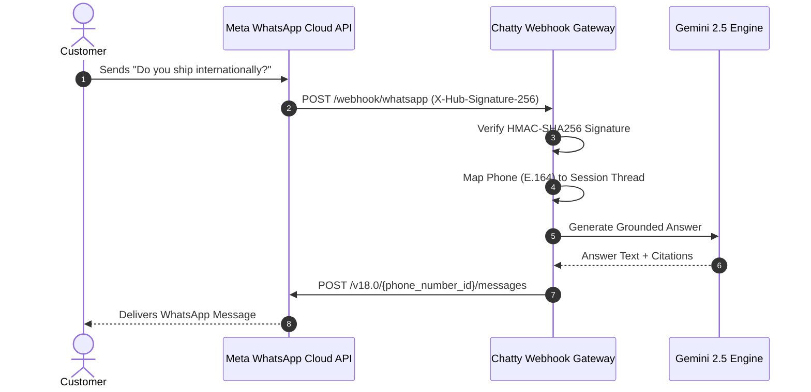

export const metadata = { title: "WhatsApp Channel", description: "Connect your Chatty AI bot to WhatsApp Business via Meta Cloud API for automated customer messaging." }

import { Note, Tip, Warning, Info } from "@/components/mdx/Callout"
import { Card, CardGroup } from "@/components/mdx/Card"
import { Accordion, AccordionGroup } from "@/components/mdx/Accordion"
import { PageNav } from "@/components/PageNav"
import { prevNext } from "@/lib/navigation"

# WhatsApp Business Integration

Deploy your Chatty AI assistant directly onto WhatsApp using the official **Meta Cloud API**. Customers can message your official business phone number, receive instant AI replies, send voice notes, and book calendar appointments without leaving WhatsApp.

---

## Prerequisites

Before starting, ensure you have:
1. A [Meta for Developers](https://developers.facebook.com/) account.
2. A verified **WhatsApp Business Account (WABA)**.
3. A clean phone number dedicated to WhatsApp Business (not already registered on personal WhatsApp).

---

## Step-by-Step Setup



### 1. Configure WhatsApp in Meta Developer Portal

1. Go to your App Dashboard in Meta for Developers &rarr; **WhatsApp** &rarr; **API Setup**.
2. Note your **Phone Number ID** and **WhatsApp Business Account ID**.
3. Under **Configuration**, locate the **Webhook** section and click **Edit**:
   - **Callback URL**: `https://api.chatty.personaliai.com/webhook/whatsapp`
   - **Verify Token**: Enter a strong secret string (you will also save this in Chatty).
4. Click **Verify and Save**.
5. Under **Webhook fields**, subscribe to `messages`.

### 2. Connect Credentials in Chatty

In the Chatty Dashboard, navigate to **Bot Settings &rarr; Channels &rarr; WhatsApp**:

| Setting | Value Description |
| :--- | :--- |
| **Phone Number ID** | 15-digit ID from Meta API Setup screen |
| **WABA ID** | WhatsApp Business Account ID |
| **Access Token** | System User Permanent Access Token with `whatsapp_business_messaging` permission |
| **Verify Token** | The exact token string entered in the Meta Webhook configuration |
| **App Secret** | Your Meta App Secret (used for cryptographic HMAC payload verification) |

---

## Supported WhatsApp Message Formats

<CardGroup cols={2}>
  <Card title="Two-Way Text Chat" icon="💬">
    Handles multi-turn conversational dialog with full markdown rendering (bold, bullet points, numbered lists).
  </Card>
  <Card title="Voice Notes & Audio" icon="🎙️">
    When customers send WhatsApp voice clips, Chatty automatically transcribes the audio using Gemini speech models and replies in text.
  </Card>
  <Card title="Document & Photo Vision" icon="📸">
    Customers can upload receipts, error screenshots, or PDFs. The vision engine parses visual data alongside customer prompts.
  </Card>
  <Card title="Interactive Buttons" icon="🔘">
    Render quick-reply buttons (e.g. <i>"Book a Call"</i>, <i>"View Pricing"</i>, <i>"Talk to Human"</i>) for friction-free navigation.
  </Card>
</CardGroup>

---

## Security & Webhook Verification

Every incoming payload from Meta is cryptographically signed using your Meta App Secret. Chatty verifies the `X-Hub-Signature-256` header before processing:

```python title="Webhook Signature Validation"
import hmac
import hashlib

def verify_meta_signature(raw_payload: bytes, signature_header: str, app_secret: str) -> bool:
    expected_sig = "sha256=" + hmac.new(
        app_secret.encode("utf-8"),
        raw_payload,
        hashlib.sha256
    ).hexdigest()
    return hmac.compare_digest(expected_sig, signature_header)
```

If the signature does not match, Chatty discards the request with `401 Unauthorized`.

---

## 24-Hour Messaging Window Rules

Meta enforces strict customer messaging window policies:
- **User-Initiated Window**: When a customer sends a message, a **24-hour service window** opens. Your bot can send unlimited conversational replies during this period.
- **Outside 24 Hours**: Once 24 hours elapse since the customer's last message, you may only reach out using pre-approved **WhatsApp Template Messages** (e.g. appointment reminders or shipping updates).

<PageNav {...prevNext("/guides/whatsapp")} />
