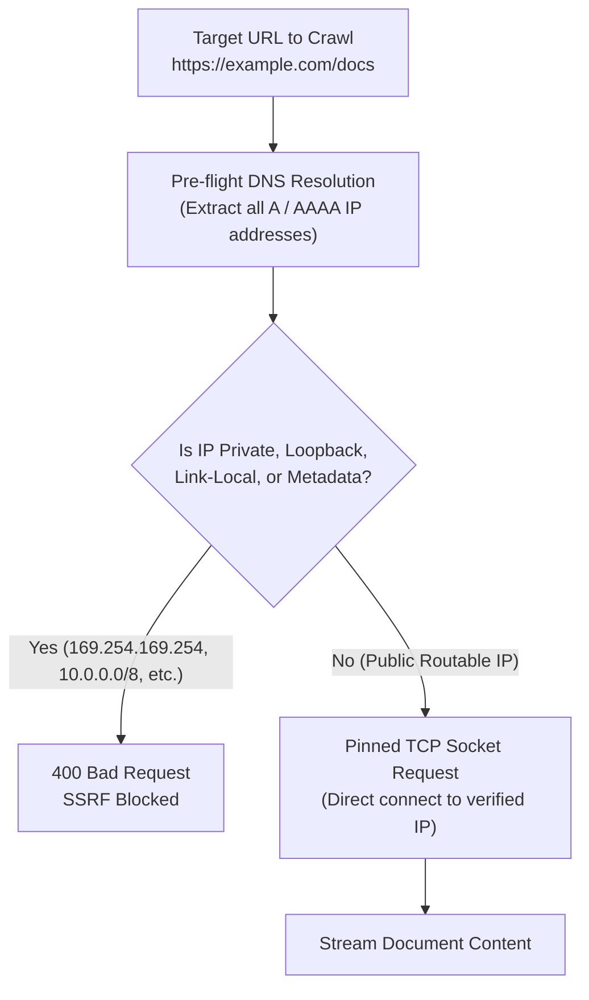

export const metadata = { title: "Security & Privacy", description: "Comprehensive security architecture, tenant isolation, anti-SSRF protections, and cryptographic standards in Chatty." }

import { Note, Tip, Warning, Info } from "@/components/mdx/Callout"
import { Card, CardGroup } from "@/components/mdx/Card"
import { Accordion, AccordionGroup } from "@/components/mdx/Accordion"
import { PageNav } from "@/components/PageNav"
import { prevNext } from "@/lib/navigation"

# Security & Privacy Architecture

At Chatty, security is not an afterthought — it is embedded into every layer of our distributed stack. Whether you use Chatty to automate customer support or index proprietary enterprise knowledge, your data is isolated, encrypted, and protected by defense-in-depth controls.

---

## Security Pillars at a Glance

<CardGroup cols={2}>
  <Card title="Tenant Data Isolation" icon="🔒">
    Strict PostgreSQL <b>Row-Level Security (RLS)</b> guarantees cross-tenant data leaks are physically impossible at the database engine level.
  </Card>
  <Card title="Anti-SSRF IP Pinning" icon="🛡️">
    All outbound URL crawlers resolve DNS pre-flight and block internal subnets (RFC 1918) and cloud metadata services.
  </Card>
  <Card title="Cryptographic Integrity" icon="🔑">
    Asymmetric <b>JWKS</b> validation for user sessions, SHA-256 API key hashing, and AES-256-GCM encryption for customer BYOK keys.
  </Card>
  <Card title="DoS & Stream Protection" icon="⚡">
    Stream-capped 20MB upload ceilings and distributed Upstash Redis token-bucket rate limiters prevent resource exhaustion.
  </Card>
</CardGroup>

---

## Outbound Network Defense: Anti-SSRF Engine

When a bot indexes a website or fetches a webhook URL, naive HTTP fetchers are vulnerable to Server-Side Request Forgery (SSRF), which attackers exploit to query cloud metadata services or internal microservices.

Chatty implements an **Anti-SSRF IP Pinning Fetcher**:



### Prohibited Subnets
Any address falling within the following ranges is rejected immediately:
- `10.0.0.0/8`, `172.16.0.0/12`, `192.168.0.0/16` (RFC 1918 Private Networks)
- `127.0.0.0/8` (Localhost loopback)
- `169.254.169.254/32` (AWS, GCP, Azure Instance Metadata Services)
- `::1`, `fc00::/7`, `fe80::/10` (IPv6 loopback, unique local, and link-local)

Furthermore, the socket connection is pinned directly to the resolved IP address to defeat **DNS rebinding attacks**.

---

## Authentication & Cryptography Standards

<AccordionGroup>
  <Accordion title="Asymmetric JWKS Key Verification">
    User sessions authenticate using asymmetric JSON Web Key Sets (JWKS). The backend verifies RSA/ECDSA digital signatures using rotating public keys provided by our authentication service, eliminating shared-secret vulnerabilities.
  </Accordion>
  <Accordion title="API Key Storage & Hashing">
    Secret API keys (`chatty_sk_...`) are displayed to developers **only once** upon generation. The database stores only a salted SHA-256 hash. API authentication validates incoming tokens using constant-time string comparison (`hmac.compare_digest`) to prevent timing side-channel attacks.
  </Accordion>
  <Accordion title="Bring Your Own Key (BYOK) Encryption">
    If you supply your own OpenAI, Anthropic, or Google Gemini API keys, they are encrypted with **AES-256-GCM** using an isolated master key stored in secret management. Keys are decrypted solely in volatile worker RAM during an active inference call and are never exposed via APIs.
  </Accordion>
  <Accordion title="Session-Bound Meeting Tokens">
    Calendar scheduling and rescheduling links use cryptographically random session tokens bound to specific meeting UUIDs, preventing Insecure Direct Object Reference (IDOR) attacks.
  </Accordion>
</AccordionGroup>

---

## Frame & Cross-Origin Security

To protect your brand and prevent malicious third parties from hijacking your AI bot, Chatty enforces strict frame-ancestor rules:

1. **Domain Allowlist**: Every bot configuration includes an approved list of origins (e.g. `yourcompany.com`, `app.yourcompany.com`).
2. **CSP Header Injection**: When the widget loads inside an iframe, the backend verifies the parent origin and injects:
   ```http
   Content-Security-Policy: frame-ancestors https://yourcompany.com https://app.yourcompany.com;
   ```
3. **Unauthorized Embed Defense**: If an unapproved domain attempts to frame your widget, browsers enforce the CSP policy and blank the iframe.

---

## Resource Protection & DoS Ceilings

AI models and vector databases are computationally intensive. Chatty deploys multiple guardrails to guarantee 99.9% uptime:

- **Streaming Upload Limit**: Multimodal document and voice uploads are piped through a streaming chunk counter. If any upload exceeds 20MB, the stream terminates immediately.
- **Distributed Redis Rate Limiting**: Every public endpoint is protected by an Upstash Redis token bucket algorithm partitioned by client IP (for widget sessions) or API key.
- **Strict Query Length**: Inbound user prompt texts are capped at 4,000 characters. Null bytes, control characters, and recursive escape sequences are stripped before reaching the LLM tokenizer.

---

## Compliance, Privacy & GDPR

Chatty empowers enterprise teams to meet global regulatory standards including GDPR, CCPA, and HIPAA privacy rules:

- **Right to Access & Portability**: Export all data associated with a bot, visitor session, or conversation thread via `GET /api/admin/gdpr/export`.
- **Right to Erasure**: Permanently purge an individual visitor's entire conversation and lead record using `DELETE /api/v1/conversations/{session_id}` or directly through the Live Inbox.
- **Configurable Retention**: Define automated data retention windows (e.g. 30, 60, or 90 days) to automatically drop historical chat logs.

<Note>
Need an enterprise Data Processing Agreement (DPA) or SOC2 report? Contact our compliance team at <b>security@personaliai.com</b>.
</Note>

<PageNav {...prevNext("/security")} />
